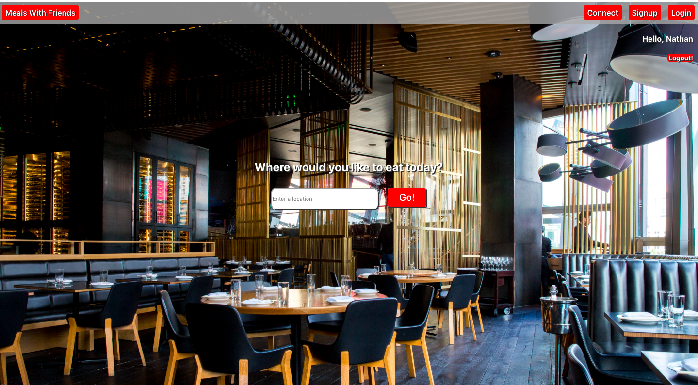
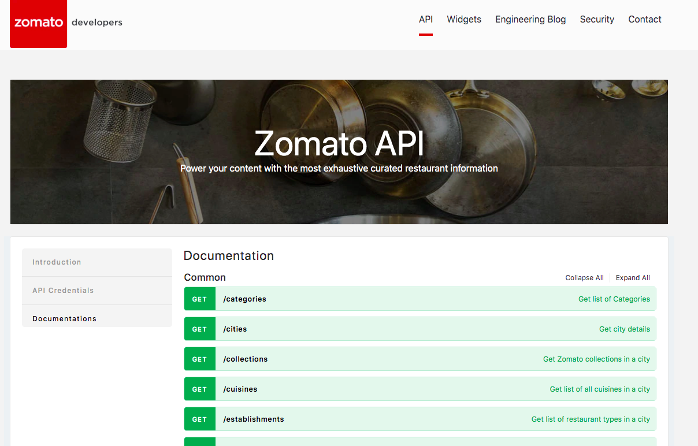
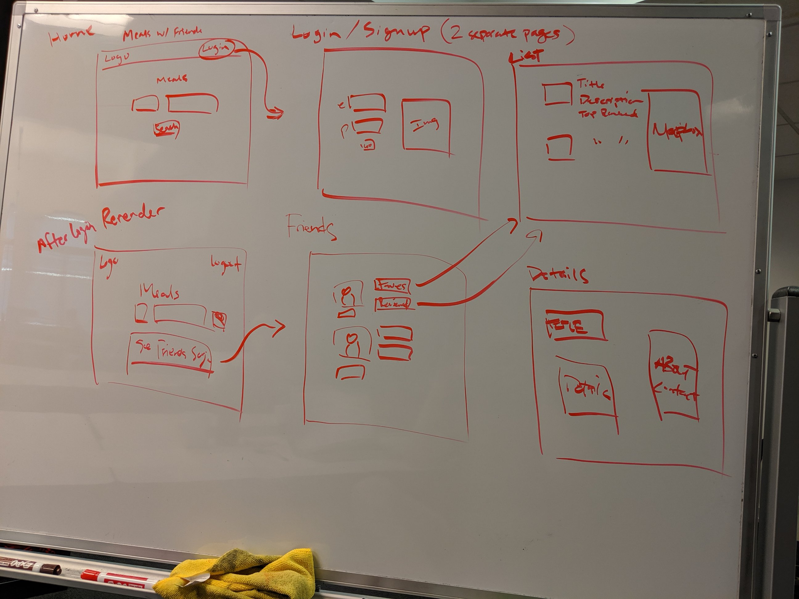
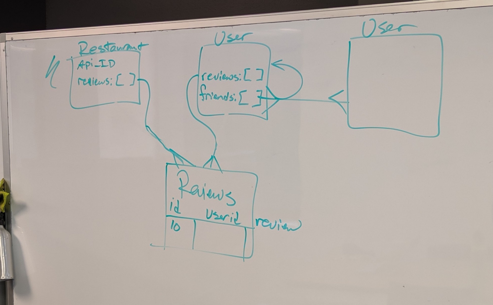
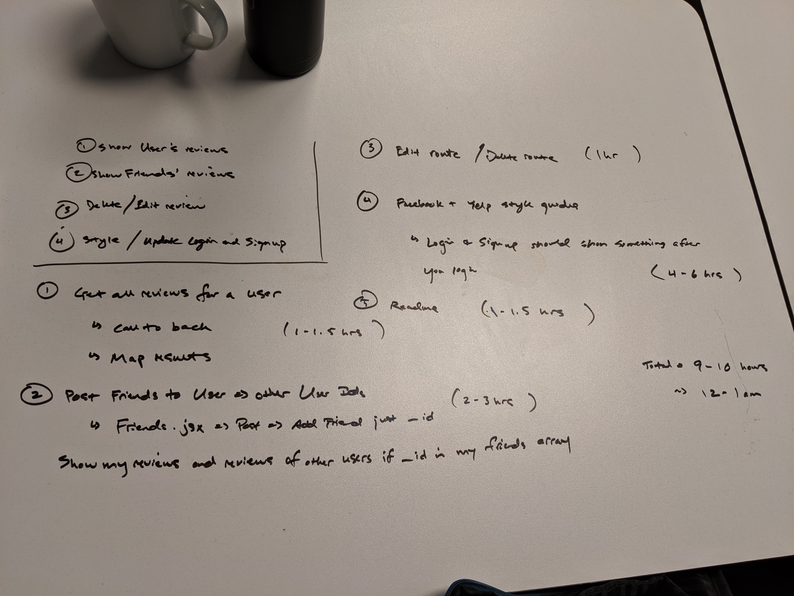

# Meals with Friends
## Nathan Chan | August 21, 2019
### General Assembly - Software Engineering Immersive Project 4: HTML, CSS, Javascript, Node.js, Express,js, React.js, Typescript, MongoDB, Mongoose
#### Check out a demo of the site here: 

## Introduction
Can't trust reviews online? Meals With Friends combines the best features of Facebook and Yelp to provide a platform that allows a user to increase his/her social network and food option at the same time. Only friends can see each other's posts. So you can be honest about what you're posting and you'll be able to make better decisions when you're looking for the next best restaurant. 

Home Page: 

## Project Requirements
This is the fourth and final project that will be incorporated as part of the portfolio of the General Assembly Software Engineering Immersive. The goal is to combined all that we have learned in the course (HTML, CSS, Javasript, Node.js, Express.js, React.js, Typescript, MongoDB, Mongoose, and Authentication) into a full-stack web application that we can publish for the public. 

## Technical Requirements
The technical requirements for the app are as follows: 
* Use Django or Express to build an application backend
* Create an application using at least 2 related models, one of which should be a user
* Include all major CRUD functions for at least one of those models
* Create your own front-end! Put effort into your design!
* Add authentication/authorization to restrict access to appropriate users
    * OAuth or Token Auth
* Manage team contributions and collaboration using a standard Git flow on Github
* Layout and style your front-end with clean & well-formatted CSS, with or without a framework.
* Deploy your application online so it's publicly accessible

## Development Process 
The development process followed a similar one as the previous projects which included planning and design phase and then a development phase.

This full-stack web app uses the MERN Stack with Typescript.

### Pulling from APIs

This project combines two APIs with an option to incorporate additional ones: 
1. Zomato API - https://developers.zomato.com
2. Mapbox API - https://docs.mapbox.com/api/search

### Zomato API:
The Zomato API provided the restaurant data and details

### Mapbox API: 
The Mapbox API was simply used for its geocoding functionality where a search term can be converted to a latitude and longitude

### Planning and Design 
Screenshots of the planning and design are shown below:

Wireframes: 

Models: 

Additional Planning: 

### Development
The development of the site started with the backend routes and tests conducted in Postman and then moved to React and the front end. All the while, the project included Typescript. 

#### Backend
The backend was built in Express with three different MongoDB models using Mongoose as an Object Document Mapper (ODM)

The backend routes established the important appropriate CRUD operations for each model. The routes were later adjusted based on the front end forms. 

The intention of the app is for people who are not logged in to be able to search and explore restaurants. A user can only see his/her friends' reviews only after he/she logs in. 

#### Frontend 
The frontend was built using React and React Hooks. 

The wireframes were used as a starting point for rendering the appropriate data on the desired pages. A limiting factor was passing props and state from one component to another given that Typescript was also used. 

## Challenges
The greatest challenge throughout the duration of this project was the usage of Typescript. According to Wikipedia, "Typescript is a strict syntactical superset of JavaScript, and adds optional static typing to the language. TypeScript is designed for development of large applications and transcompiles to JavaScript."

The benefit of using something like Typescript is the ability to catch errors prior to testing and development. However, the greatest challenge is that if there are any errors at all due to an incorrect typing then the app will not compile. 

In particular, typing objects and functions are the most challenging aspect of Typescript because each model, object, and React functional component generally requires an interface. The interface allows a user to define the shape of the object or what props a functional component will need. In order for this to happen the developer needs to be very clear how different models, objects, components, and interfaces are linked. 

## Built with
* HTML 
* CSS
* Javascript
* Google Fonts
* Node.js
* Express.js
* React.js / React Hooks
* MongoDB
* Mongoose
* Typescript

## Credit To:
* zomato.com and yelp.com for web content and layout inspiration
* Zomato API
* Mapbox API

## Additonal Collaborators: 
Thanks to Steve Peters, Mike Shull, Kelsey Cox, and many others in the SEI-SEA-25 cohort for their ideas and thoughts that were incorporated in this project

## Next Steps / Wish List
Some next steps and wish list features for this project include: 
* Profile page and the ability to update personal info
* Additional styling
* Reorganization of the file structure and code to optimize for better Typescript and React organization
* The ability to remove friends as well as the ability to only show one friend
* Improving the functionality of the reviews and ensuring that the reviews that are shown are only ones submitted by the user's friends
* Reorganization of the UX/UI
